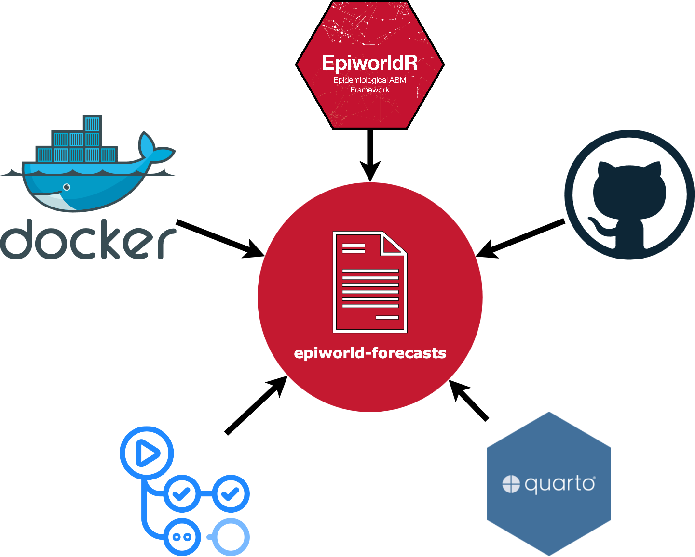
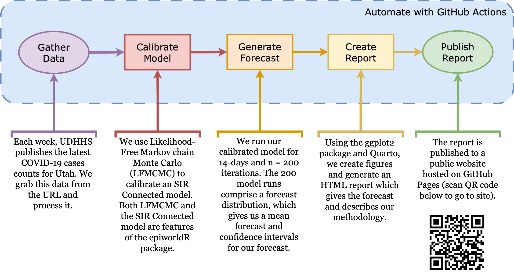

# epiworld-forecasts

`epiworld-forecasts` is a template repository that provides scaffolding for automated disease forecasts using [`epiworldR`](https://github.com/UofUEpiBio/epiworldR/), an R package for fast agent-based model (ABM) disease simulations.

Disease forecasts typically follow these steps:

1. Gather data
2. Calibrate a model on the data
3. Make a forecast with the calibrated model
4. Create a report with figures and descriptions
5. Publish the report

The epiworld-forecasts tool automates these steps, creating forecasts that regularly update without human intervention. This saves researchers and public health officials time and effort.

## Technologies

**`epiworld-forecasts`** is fully automated, powered by the following technologies:

* **Docker:** Contains all the software packages needed to run the forecast
* **GitHub Actions:** Runs the forecast inside the Docker container, manages the schedule of forecast runs, builds and pushes the Docker image to the GitHub Container Registry
* **Quarto:** Generates the forecast's report in an HTML webpage which is then published to GitHub Pages
* **GitHub:** Hosts source code repository and forecast website via GitHub Pages

## Example Forecast

To demonstrate the capabilities of `epiworld-forecasts`, we created an example forecast.
This is a 14-day forecast of COVID-19 case counts in Utah using data published weekly by the UDHHS.
The forecast updates weekly and is published to [this website](https://epiforesite.github.io/epiworld-forecasts/).

## Adapting `epiworld-forecasts` for Your Needs

The core of this tool is the pipeline technologies (GHA Actions, Docker, Quarto) that allow the forecast to run automatically.
As such, the tool can be adapted for different:

* Data sources
* Model calibrations
* Forecast characteristics (algorithm used, duration of forecast, etc.)
* Report characteristics (text, figures, etc.)
* Publishing destinations (website, PDF, etc.)
* Forecast schedules
* Docker containers

### Breakdown of `epiworld-forecasts` files

Below is a description of each core file in the `epiworld-forecasts` tool and how you might want to modify the file for your specific project needs.

R files:
* [**`forecast-pkg.R`**](./forecast-pkg.R): Adds libraries and generic functions for running a forecast.
    * This file will likely require the fewest modifications, because the functions are agnostic to a specific disease forecast.
    * In our example, this file:
        * Loads the `epiworldR` library
        * Defines function for getting data from a given URL
        * Defines functions for computing the season from a date

* [**`plot-forecast.R`**](./plot-forecast.R): Adds libraries and functions for plotting forecast outputs.
    * All of your visualization functions go in here. This file will require modifications to accommodate the shape of your data and what you desire to visualize.
    * In our example, this file:
        * Loads the `ggplot2` library
        * Defines functions for plotting observed data, LFMCMC parameter posterior distributions, and the final forecast
* [**`covid-forecast.R`**](./covid-forecast.R): Runs the forecast
    * In our example, this file:
        * Loads the `tidyr` library

Quarto (website) files:
* [**`_quarto.yml`**](./_quarto.yml):
* [**`index.qmd`**](./index.qmd):
* [**`methodology.qmd`**](./methodology.qmd):
* [**`about.qmd`**](./about.qmd):

Automation files:
* [**`.github/workflows/run-forecast.yml`**](./.github/workflows/run-forecast.yml):
* [**`.devcontainer/Dockerfile`**](./.devcontainer/Dockerfile):
* [**`.github/workflows/build-docker-image.yml`**](./.github/workflows/build-docker-image.yml):

## Data Sources
For our example forecast, we use the [weekly reports](https://coronavirus.utah.gov/case-counts/) published by Utah DHHS on COVID-19.
This includes a lot of different data, but we focus on COVID-19 case counts for the entire state.

Future forecasts, might look to other data sources, such as:
- DELPHI maintains a frequently updated COVID data API [here](https://cmu-delphi.github.io/delphi-epidata/api/covidcast.html) and additional endpoints (less frequently updated) for influenza, dengue, and norovirus [here](https://cmu-delphi.github.io/delphi-epidata/api/README.html)
- CDC's [public datasets](https://data.cdc.gov), some are updated infrequently, others are weekly estimates (e.g., [weekly flu vaccine estimates](https://data.cdc.gov/Vaccinations/Weekly-Cumulative-Estimated-Number-of-Influenza-Va/ysd3-txwj/about_data)

## Other Relevant Resources
It's worth also taking a look at:
- DELPHI's [R packages](https://delphi.cmu.edu/code/)
- [RSV Forecast Hub](https://rsvforecasthub.org/#Overview)
- [Epinowcast](https://www.epinowcast.org) and the Epinowcast [community forums](https://community.epinowcast.org)

## Code of Conduct

The `epiworld-forecasts` project is released with a [Contributor Code of Conduct](./CODE_OF_CONDUCT.md).
By contributing to this project, you agree to abide by its terms.
More information about how to contribute to the project can be found under [`DEVELOPMENT.md`](DEVELOPMENT.md).
